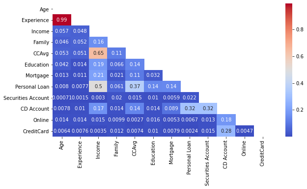
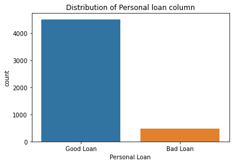

# Bank Loan Classification
## Table of Contents

- Background
- Findings
  - Feature correlations
  - Target class distribution
- Usage
- Business Value 

## Background

Having previously worked in a bank which specialized in loans, I was curious to know how loans could be better classified. I saw how bad loans had cost the bank a lot. When I decided to go into data science, I knew that this would be my first project.
In this project I worked on a binary classification problem, where I built several models to determine the model that best classifies the target variable based on the available independent features.
- **Data Source**: Kaggle (https://www.kaggle.com/sriharipramod/bank-loan-classification)
- **Problem Statement**: To best classify the target varible - Personal loan, with much attention given to correctly classify the minority class

## Findings

### Feature correlations

### Target class distribution

## Usage

This project is best viewed in a notebook viewer, which can be accessed here. In this notebook, you will find a walk through of the work done and the respective code.

## Business Value

Bank loans play a crucial role in the development of banks investment business. ML algorithms can help predict the customers who are at risk for defaulting on their loans to help companies rethink or adjust terms for each customer, thereby saving cost.
